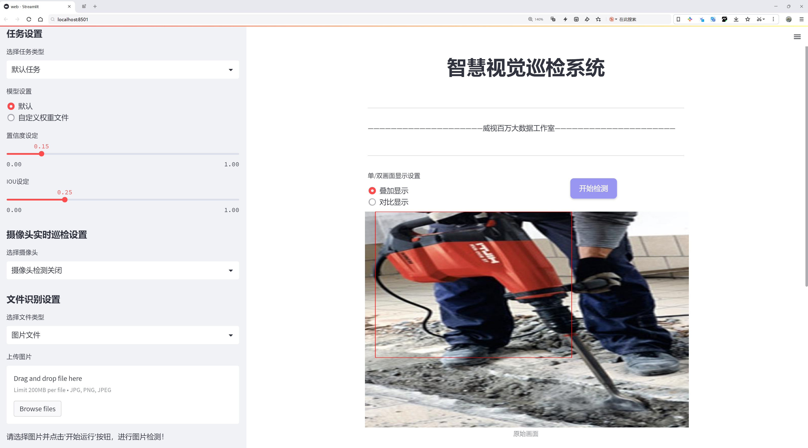

# 钻孔工具检测检测系统源码分享
 # [一条龙教学YOLOV8标注好的数据集一键训练_70+全套改进创新点发刊_Web前端展示]

### 1.研究背景与意义

项目参考[AAAI Association for the Advancement of Artificial Intelligence](https://gitee.com/qunshansj/projects)

项目来源[AACV Association for the Advancement of Computer Vision](https://gitee.com/qunmasj/projects)

研究背景与意义

随着工业自动化和智能制造的快速发展，钻孔工具的检测与管理在生产过程中显得尤为重要。钻孔工具作为机械加工中的关键设备，其性能直接影响到生产效率和产品质量。传统的人工检测方法不仅耗时耗力，而且容易受到人为因素的影响，导致检测结果的不准确性。因此，开发一种高效、准确的钻孔工具检测系统，能够有效提升生产线的自动化水平和产品质量，具有重要的现实意义。

近年来，深度学习技术的迅猛发展为物体检测领域带来了新的机遇。YOLO（You Only Look Once）系列模型以其高效的实时检测能力和较高的准确率，成为物体检测领域的研究热点。YOLOv8作为该系列的最新版本，结合了多种先进的技术和算法，具备了更强的特征提取能力和更快的推理速度。通过对YOLOv8模型的改进，可以更好地适应钻孔工具的检测需求，从而实现高效、精准的自动化检测。

本研究基于改进YOLOv8的钻孔工具检测系统，利用5500张标注良好的钻孔工具图像数据集，旨在提升钻孔工具的检测精度和速度。该数据集包含了丰富的钻孔工具图像，涵盖了不同角度、不同光照条件下的样本，为模型的训练和验证提供了坚实的基础。通过对数据集的深入分析与处理，可以有效提高模型的泛化能力，进而提升检测系统在实际应用中的表现。

此外，随着工业4.0的推进，智能制造的理念逐渐深入人心，企业对生产设备的智能化管理需求日益增加。基于改进YOLOv8的钻孔工具检测系统不仅可以实现对工具状态的实时监测，还能够通过数据分析提供设备维护和更换的建议，帮助企业优化生产流程，降低运营成本。通过实现钻孔工具的智能检测，企业能够在激烈的市场竞争中保持优势，提升整体生产效率。

综上所述，基于改进YOLOv8的钻孔工具检测系统的研究，不仅具有重要的理论价值，也具备广泛的应用前景。通过该系统的开发与应用，可以为工业生产提供更加智能化的解决方案，推动制造业的数字化转型与升级。同时，该研究也为深度学习在工业检测领域的应用提供了新的思路和方法，具有重要的学术意义和实践价值。

### 2.图片演示




##### 注意：由于此博客编辑较早，上面“2.图片演示”和“3.视频演示”展示的系统图片或者视频可能为老版本，新版本在老版本的基础上升级如下：（实际效果以升级的新版本为准）

  （1）适配了YOLOV8的“目标检测”模型和“实例分割”模型，通过加载相应的权重（.pt）文件即可自适应加载模型。

  （2）支持“图片识别”、“视频识别”、“摄像头实时识别”三种识别模式。

  （3）支持“图片识别”、“视频识别”、“摄像头实时识别”三种识别结果保存导出，解决手动导出（容易卡顿出现爆内存）存在的问题，识别完自动保存结果并导出到tempDir中。

  （4）支持Web前端系统中的标题、背景图等自定义修改，后面提供修改教程。

  另外本项目提供训练的数据集和训练教程,暂不提供权重文件（best.pt）,需要您按照教程进行训练后实现图片演示和Web前端界面演示的效果。

### 3.视频演示

[3.1 视频演示](https://www.bilibili.com/video/BV141tNeREg9/)

### 4.数据集信息展示

##### 4.1 本项目数据集详细数据（类别数＆类别名）

nc: 1
names: ['Drill']


##### 4.2 本项目数据集信息介绍

数据集信息展示

在本研究中，我们采用了名为“drill”的数据集，以训练和改进YOLOv8模型在钻孔工具检测系统中的应用。该数据集专注于钻孔工具的识别与定位，旨在提升自动化检测的准确性和效率。数据集的设计充分考虑了实际应用场景，确保所收集的数据能够有效反映出钻孔工具在不同环境和条件下的特征。

“drill”数据集包含了一个类别，即“Drill”。这一类别的选择不仅突出了钻孔工具在工业生产和建筑施工中的重要性，也为模型的训练提供了明确的目标。通过专注于单一类别，研究团队能够更深入地分析和优化YOLOv8模型在特定任务上的表现，进而提升其在实际应用中的可靠性和准确性。

数据集的构建过程涵盖了多种钻孔工具的拍摄和标注，确保数据的多样性和代表性。我们从不同的角度、光照条件和背景环境中收集了大量的图像数据，以便模型能够学习到更全面的特征。每一张图像都经过精细的标注，确保“Drill”这一类别的每个实例都能被准确识别和定位。这种细致的标注工作不仅提高了数据集的质量，也为后续的模型训练提供了坚实的基础。

在数据集的使用过程中，我们特别关注了图像的分辨率和清晰度，以确保模型能够在高质量的输入下进行训练。这一方面有助于提高模型的检测精度，另一方面也为后续的实时应用提供了保障。随着深度学习技术的不断发展，模型的训练效果在很大程度上依赖于输入数据的质量，因此我们在数据集的构建过程中始终坚持高标准、高质量的原则。

此外，为了增强模型的泛化能力，我们还对数据集进行了数据增强处理，包括随机裁剪、旋转、翻转等操作。这些操作不仅丰富了训练样本的多样性，也帮助模型在面对不同的环境变化时，依然能够保持较高的检测性能。通过这种方式，我们希望能够提升YOLOv8在实际应用中的适应性，使其能够更好地应对复杂的工作场景。

总之，“drill”数据集的构建与应用为改进YOLOv8的钻孔工具检测系统提供了重要的支持。通过对数据集的精心设计和处理，我们期望能够在模型的训练和测试中取得显著的进展，最终实现高效、准确的钻孔工具检测。这一研究不仅有助于推动自动化检测技术的发展，也为相关领域的应用提供了有力的技术支持。


### 5.全套项目环境部署视频教程（零基础手把手教学）

[5.1 环境部署教程链接（零基础手把手教学）](https://www.ixigua.com/7404473917358506534?logTag=c807d0cbc21c0ef59de5)


[5.2 安装Python虚拟环境创建和依赖库安装视频教程链接（零基础手把手教学）](https://www.ixigua.com/7404474678003106304?logTag=1f1041108cd1f708b01a)

### 6.手把手YOLOV8训练视频教程（零基础小白有手就能学会）

[6.1 手把手YOLOV8训练视频教程（零基础小白有手就能学会）](https://www.ixigua.com/7404477157818401292?logTag=d31a2dfd1983c9668658)

### 7.70+种全套YOLOV8创新点代码加载调参视频教程（一键加载写好的改进模型的配置文件）

[7.1 70+种全套YOLOV8创新点代码加载调参视频教程（一键加载写好的改进模型的配置文件）](https://www.ixigua.com/7404478314661806627?logTag=29066f8288e3f4eea3a4)

### 8.70+种全套YOLOV8创新点原理讲解（非科班也可以轻松写刊发刊，V10版本正在科研待更新）

由于篇幅限制，每个创新点的具体原理讲解就不一一展开，具体见下列网址中的创新点对应子项目的技术原理博客网址【Blog】：


[8.1 70+种全套YOLOV8创新点原理讲解链接](https://gitee.com/qunmasj/good)

### 9.系统功能展示（检测对象为举例，实际内容以本项目数据集为准）

图9.1.系统支持检测结果表格显示

  图9.2.系统支持置信度和IOU阈值手动调节

  图9.3.系统支持自定义加载权重文件best.pt(需要你通过步骤5中训练获得)

  图9.4.系统支持摄像头实时识别

  图9.5.系统支持图片识别

  图9.6.系统支持视频识别

  图9.7.系统支持识别结果文件自动保存

  图9.8.系统支持Excel导出检测结果数据


### 10.原始YOLOV8算法原理

原始YOLOv8算法原理

YOLOv8算法是目标检测领域的一次重要进步，承载着YOLO系列算法的优良传统，并在此基础上进行了多项创新和优化。作为一种单阶段检测算法，YOLOv8在检测精度和速度上均表现出色，适用于多种视觉任务，包括目标检测、图像分割和图像分类等。其结构设计围绕输入、Backbone骨干网络、Neck特征融合网络和Head检测模块四个主要部分展开，形成了一个高效且灵活的网络框架。

在输入部分，YOLOv8采用640x640的默认图像尺寸，但在实际应用中，考虑到图像长宽比的多样性，算法引入了自适应图片缩放技术。这一方法通过将图像的长边按比例缩小至指定尺寸，然后对短边进行填充，从而减少信息冗余，提高目标检测的效率。此外，YOLOv8在训练过程中引入了Mosaic增强技术，通过随机拼接四张图像生成新的训练样本，使模型能够学习到不同位置和周围像素的特征，从而有效提升预测精度。

YOLOv8的Backbone部分是其特征提取的核心，延续了YOLOv5的设计理念，但进行了显著的改进。具体而言，YOLOv8将C3模块替换为C2f模块，后者通过引入更多的分支，增强了梯度流动的信息量。这种设计不仅保持了网络的轻量化特性，还提高了特征提取的精度。C2f模块的并行结构使得网络在进行特征回传时，能够更好地捕捉到多样化的特征信息，进而提升模型的整体性能。

在Neck部分，YOLOv8继续采用特征金字塔网络（FPN）和路径聚合网络（PAN）的结合方式，以实现多尺度特征的有效融合。相较于YOLOv5，YOLOv8在Neck部分的结构进行了优化，去除了多余的卷积连接层，直接对Backbone不同阶段输出的特征进行上采样。这一改进不仅简化了网络结构，还加速了特征融合的过程，使得网络能够更好地处理不同尺度的目标。

YOLOv8的Head模块是其最大的创新之一，采用了解耦头结构。与以往的耦合头不同，解耦头将分类和定位任务分开处理，分别通过独立的卷积层进行特征提取。这种设计使得模型在进行目标检测时，能够更清晰地分离出类别特征和位置特征，从而提高了检测的准确性和效率。此外，YOLOv8在损失函数的设计上也进行了优化，采用了Varifocal Loss（VFL）和CIoU Loss与DFL Loss的组合，旨在更好地处理正负样本的不平衡问题。VFL通过不对称参数对正负样本进行加权，使得高质量的正样本对损失的贡献更大，而负样本的影响则被有效降低。

YOLOv8还摒弃了传统的Anchor-Based方法，转而采用Anchor-Free的策略。这一转变使得目标检测不再依赖于预设的锚框，而是将目标检测转化为关键点检测，极大地提高了模型的灵活性和泛化能力。通过这种方式，YOLOv8能够更好地适应不同的数据集，减少了因锚框设计不当而导致的性能下降。

总的来说，YOLOv8算法通过对输入、Backbone、Neck和Head等模块的全面优化，构建了一个高效、准确且灵活的目标检测框架。其在多项技术上的创新，不仅提升了模型的性能，还为未来的目标检测研究提供了新的思路和方向。随着YOLOv8的推广和应用，目标检测技术将进一步向着更高的精度和更快的速度发展，推动计算机视觉领域的进步。


### 11.项目核心源码讲解（再也不用担心看不懂代码逻辑）

#### 11.1 code\ultralytics\utils\files.py

以下是对代码中最核心部分的分析和详细注释：

```python
import os
from pathlib import Path
from contextlib import contextmanager
import tempfile
import shutil
import glob
from datetime import datetime

@contextmanager
def spaces_in_path(path):
    """
    处理路径中包含空格的上下文管理器。如果路径包含空格，则将其替换为下划线，
    复制文件/目录到新路径，执行上下文代码块，然后将文件/目录复制回原位置。

    参数:
        path (str | Path): 原始路径。

    返回:
        (Path): 如果路径中有空格，则返回替换下划线的临时路径，否则返回原始路径。
    """
    if " " in str(path):
        # 如果路径中有空格，创建一个临时目录并构造新的路径
        path = Path(path)
        with tempfile.TemporaryDirectory() as tmp_dir:
            tmp_path = Path(tmp_dir) / path.name.replace(" ", "_")

            # 复制文件/目录
            if path.is_dir():
                shutil.copytree(path, tmp_path)
            elif path.is_file():
                tmp_path.parent.mkdir(parents=True, exist_ok=True)
                shutil.copy2(path, tmp_path)

            try:
                # 返回临时路径
                yield tmp_path
            finally:
                # 将文件/目录复制回原位置
                if tmp_path.is_dir():
                    shutil.copytree(tmp_path, path, dirs_exist_ok=True)
                elif tmp_path.is_file():
                    shutil.copy2(tmp_path, path)
    else:
        # 如果没有空格，直接返回原始路径
        yield path


def increment_path(path, exist_ok=False, sep="", mkdir=False):
    """
    增加文件或目录路径，即 runs/exp --> runs/exp{sep}2, runs/exp{sep}3, ... 等。

    如果路径存在且 exist_ok 未设置为 True，则通过在路径末尾附加数字和分隔符来增加路径。
    如果路径是文件，则保留文件扩展名；如果路径是目录，则直接在路径末尾附加数字。
    如果 mkdir 设置为 True，则如果路径不存在，则创建该路径。

    参数:
        path (str, pathlib.Path): 要增加的路径。
        exist_ok (bool, optional): 如果为 True，则路径不会增加，直接返回原路径。默认为 False。
        sep (str, optional): 在路径和增加的数字之间使用的分隔符。默认为 ''。
        mkdir (bool, optional): 如果路径不存在，则创建目录。默认为 False。

    返回:
        (pathlib.Path): 增加后的路径。
    """
    path = Path(path)  # 转换为 Path 对象
    if path.exists() and not exist_ok:
        path, suffix = (path.with_suffix(""), path.suffix) if path.is_file() else (path, "")

        # 增加路径
        for n in range(2, 9999):
            p = f"{path}{sep}{n}{suffix}"  # 增加路径
            if not os.path.exists(p):
                break
        path = Path(p)

    if mkdir:
        path.mkdir(parents=True, exist_ok=True)  # 创建目录

    return path


def get_latest_run(search_dir="."):
    """
    返回最近的 'last.pt' 文件的路径（即用于 --resume 的路径）。
    
    参数:
        search_dir (str): 搜索目录，默认为当前目录。

    返回:
        str: 最近的 'last.pt' 文件路径，如果没有找到则返回空字符串。
    """
    last_list = glob.glob(f"{search_dir}/**/last*.pt", recursive=True)
    return max(last_list, key=os.path.getctime) if last_list else ""
```

### 核心部分分析：
1. **`spaces_in_path`**: 这个上下文管理器处理路径中包含空格的情况，确保在执行代码时不会因为路径中的空格而导致错误。它会在执行代码前复制文件/目录到一个临时路径，执行完后再将其复制回去。

2. **`increment_path`**: 这个函数用于生成一个新的文件或目录路径，避免路径冲突。它会在路径末尾附加一个数字，确保新路径是唯一的。

3. **`get_latest_run`**: 这个函数用于查找最近的训练结果文件，通常用于恢复训练时使用。它会在指定目录下查找符合条件的文件，并返回最新的一个。

这些功能是处理文件和目录操作的基础，适用于许多需要管理文件路径和临时文件的场景。

这个文件是一个用于处理文件和目录的工具类，主要包含一些实用的函数和上下文管理器，适用于Ultralytics YOLO项目。首先，文件中定义了一个`WorkingDirectory`类，这个类实现了上下文管理器的功能，可以在指定的目录中执行代码，并在执行结束后自动恢复到原来的工作目录。使用时可以通过装饰器或`with`语句来实现。

接下来，文件中定义了一个名为`spaces_in_path`的上下文管理器。这个管理器的作用是处理路径中包含空格的情况。如果路径中有空格，它会将空格替换为下划线，并将文件或目录复制到一个临时路径中，执行上下文代码块后再将其复制回原来的位置。这对于避免在某些操作中因路径中存在空格而导致的问题非常有用。

文件中还有一个`increment_path`函数，用于对文件或目录路径进行递增处理。如果指定的路径已经存在，并且`exist_ok`参数为`False`，该函数会在路径后附加一个数字以生成新的路径。对于文件，数字会附加在文件名和扩展名之间；对于目录，数字会直接附加在目录名后。如果`mkdir`参数为`True`，函数会在路径不存在时创建该目录。

此外，文件还包含一些用于获取文件信息的函数，包括`file_age`、`file_date`和`file_size`。`file_age`函数返回自上次更新以来的天数，`file_date`函数返回文件的可读修改日期，而`file_size`函数则返回文件或目录的大小（以MB为单位）。`file_size`函数能够处理文件和目录的大小计算，对于目录，它会递归计算所有文件的大小。

最后，文件中还有一个`get_latest_run`函数，用于返回指定目录下最新的`last.pt`文件的路径，通常用于恢复训练的状态。该函数使用`glob`模块查找符合条件的文件，并通过文件的创建时间来确定最新的文件。

总体来说，这个文件提供了一系列实用的工具函数和上下文管理器，方便用户在处理文件和目录时进行各种操作，尤其是在机器学习和深度学习项目中，文件管理是一个常见的需求。

#### 11.2 70+种YOLOv8算法改进源码大全和调试加载训练教程（非必要）\ultralytics\models\yolo\detect\predict.py

以下是经过简化和注释的核心代码部分：

```python
# 导入必要的模块
from ultralytics.engine.predictor import BasePredictor
from ultralytics.engine.results import Results
from ultralytics.utils import ops

class DetectionPredictor(BasePredictor):
    """
    DetectionPredictor类，继承自BasePredictor，用于基于检测模型进行预测。
    """

    def postprocess(self, preds, img, orig_imgs):
        """
        对预测结果进行后处理，并返回Results对象的列表。

        参数:
        preds: 模型的预测结果
        img: 输入图像
        orig_imgs: 原始图像（可能是torch.Tensor或numpy数组）

        返回:
        results: 包含处理后结果的Results对象列表
        """
        # 应用非极大值抑制（NMS）来过滤预测框
        preds = ops.non_max_suppression(preds,
                                         self.args.conf,  # 置信度阈值
                                         self.args.iou,   # IOU阈值
                                         agnostic=self.args.agnostic_nms,  # 是否使用类别无关的NMS
                                         max_det=self.args.max_det,  # 最大检测框数量
                                         classes=self.args.classes)  # 过滤的类别

        # 如果输入的原始图像不是列表，则将其转换为numpy数组
        if not isinstance(orig_imgs, list):
            orig_imgs = ops.convert_torch2numpy_batch(orig_imgs)

        results = []  # 初始化结果列表
        for i, pred in enumerate(preds):  # 遍历每个预测结果
            orig_img = orig_imgs[i]  # 获取对应的原始图像
            # 将预测框的坐标缩放到原始图像的尺寸
            pred[:, :4] = ops.scale_boxes(img.shape[2:], pred[:, :4], orig_img.shape)
            img_path = self.batch[0][i]  # 获取图像路径
            # 创建Results对象并添加到结果列表
            results.append(Results(orig_img, path=img_path, names=self.model.names, boxes=pred))
        
        return results  # 返回处理后的结果列表
```

### 代码说明：
1. **类定义**：`DetectionPredictor`类继承自`BasePredictor`，用于实现目标检测的预测功能。
2. **后处理方法**：`postprocess`方法对模型的预测结果进行后处理，主要包括：
   - 应用非极大值抑制（NMS）来去除冗余的预测框。
   - 将原始图像转换为numpy数组（如果需要）。
   - 对每个预测框进行坐标缩放，以适应原始图像的尺寸。
   - 创建并返回包含所有预测结果的`Results`对象列表。

该程序文件是一个用于YOLOv8目标检测模型预测的实现，主要继承自`BasePredictor`类。文件的开头部分包含了版权信息，表明该代码遵循AGPL-3.0许可证。

在代码中，定义了一个名为`DetectionPredictor`的类，该类专门用于基于检测模型进行预测。类的文档字符串中提供了一个示例，展示了如何使用该类进行预测。示例中首先导入了必要的模块，然后创建了一个包含模型路径和数据源的参数字典，接着实例化了`DetectionPredictor`对象，并调用`predict_cli()`方法进行预测。

`DetectionPredictor`类中有一个名为`postprocess`的方法，该方法用于对模型的预测结果进行后处理。该方法接收三个参数：`preds`（模型的预测结果）、`img`（输入图像）和`orig_imgs`（原始图像）。在方法内部，首先调用`ops.non_max_suppression`函数对预测结果进行非极大值抑制，以过滤掉冗余的检测框。这个过程使用了多个参数，如置信度阈值、IOU阈值、是否进行类别无关的NMS、最大检测框数量以及指定的类别。

接下来，代码检查输入的原始图像是否为列表，如果不是，则将其转换为NumPy数组。然后，程序会遍历每个预测结果，调整预测框的坐标以适应原始图像的尺寸，并将结果存储在一个`Results`对象中。每个`Results`对象包含了原始图像、图像路径、模型名称和检测框信息。最后，方法返回一个包含所有结果的列表。

整体来看，该文件的主要功能是对YOLOv8模型的预测结果进行处理，以便于后续的分析和展示。

#### 11.3 ui.py

以下是代码中最核心的部分，并附上详细的中文注释：

```python
import sys
import subprocess

def run_script(script_path):
    """
    使用当前 Python 环境运行指定的脚本。

    Args:
        script_path (str): 要运行的脚本路径

    Returns:
        None
    """
    # 获取当前 Python 解释器的路径
    python_path = sys.executable

    # 构建运行命令，使用 streamlit 运行指定的脚本
    command = f'"{python_path}" -m streamlit run "{script_path}"'

    # 执行命令，使用 subprocess.run 来运行命令
    result = subprocess.run(command, shell=True)
    
    # 检查命令执行的返回码，如果不为0，表示出错
    if result.returncode != 0:
        print("脚本运行出错。")


# 实例化并运行应用
if __name__ == "__main__":
    # 指定要运行的脚本路径
    script_path = "web.py"  # 这里可以直接指定脚本名

    # 调用函数运行脚本
    run_script(script_path)
```

### 代码注释说明：
1. **导入模块**：
   - `sys`：用于获取当前 Python 解释器的路径。
   - `subprocess`：用于执行外部命令。

2. **`run_script` 函数**：
   - 定义一个函数，接受一个参数 `script_path`，表示要运行的脚本路径。
   - 使用 `sys.executable` 获取当前 Python 解释器的路径，以便在命令中调用。
   - 构建一个命令字符串，使用 `streamlit` 模块运行指定的脚本。
   - 使用 `subprocess.run` 执行构建的命令，并通过 `shell=True` 允许在 shell 中执行。
   - 检查命令的返回码，如果返回码不为0，表示脚本运行出错，打印错误信息。

3. **主程序部分**：
   - 使用 `if __name__ == "__main__":` 确保只有在直接运行该脚本时才会执行以下代码。
   - 指定要运行的脚本路径（这里直接使用脚本名 `web.py`）。
   - 调用 `run_script` 函数，传入脚本路径以执行。

这个程序文件名为 `ui.py`，主要功能是通过当前的 Python 环境来运行一个指定的脚本。文件中首先导入了必要的模块，包括 `sys`、`os` 和 `subprocess`，以及一个自定义的路径处理模块 `abs_path`。

在 `run_script` 函数中，首先获取当前 Python 解释器的路径，这样可以确保使用的是正确的 Python 环境。接着，构建一个命令字符串，这个命令将会调用 `streamlit` 来运行指定的脚本。`streamlit` 是一个用于构建数据应用的库，这里通过 `-m` 参数来运行它。

然后，使用 `subprocess.run` 方法执行构建好的命令。这个方法会在新的 shell 中运行命令，并等待其完成。如果命令执行的返回码不为 0，表示脚本运行过程中出现了错误，此时会打印出“脚本运行出错”的提示信息。

在文件的最后部分，使用 `if __name__ == "__main__":` 来判断是否是直接运行该脚本。如果是，程序会指定一个脚本路径，这里是通过 `abs_path` 函数获取的 `web.py` 的绝对路径。然后调用 `run_script` 函数来执行这个脚本。

整体来看，这个程序的设计目的是为了方便地运行一个名为 `web.py` 的脚本，并确保在当前的 Python 环境中执行，适合用于开发和测试 Streamlit 应用。

#### 11.4 code\ultralytics\models\nas\model.py

以下是经过简化和注释的核心代码部分：

```python
from pathlib import Path
import torch
from ultralytics.engine.model import Model
from ultralytics.utils.torch_utils import model_info, smart_inference_mode
from .predict import NASPredictor
from .val import NASValidator

class NAS(Model):
    """
    YOLO NAS模型用于目标检测。

    该类提供YOLO-NAS模型的接口，并扩展了Ultralytics引擎中的`Model`类。
    旨在通过预训练或自定义训练的YOLO-NAS模型来简化目标检测任务。
    """

    def __init__(self, model="yolo_nas_s.pt") -> None:
        """初始化NAS模型，使用提供的模型或默认的'yolo_nas_s.pt'模型。"""
        # 确保模型文件不是YAML配置文件
        assert Path(model).suffix not in (".yaml", ".yml"), "YOLO-NAS模型仅支持预训练模型。"
        super().__init__(model, task="detect")  # 调用父类构造函数

    @smart_inference_mode()
    def _load(self, weights: str, task: str):
        """加载现有的NAS模型权重，或如果未提供则创建一个新的NAS模型。"""
        import super_gradients

        suffix = Path(weights).suffix
        if suffix == ".pt":
            self.model = torch.load(weights)  # 从.pt文件加载模型
        elif suffix == "":
            self.model = super_gradients.training.models.get(weights, pretrained_weights="coco")  # 获取预训练模型

        # 标准化模型设置
        self.model.fuse = lambda verbose=True: self.model  # 融合模型
        self.model.stride = torch.tensor([32])  # 设置步幅
        self.model.names = dict(enumerate(self.model._class_names))  # 设置类别名称
        self.model.is_fused = lambda: False  # 模型是否已融合
        self.model.yaml = {}  # 模型的YAML配置
        self.model.pt_path = weights  # 模型权重路径
        self.model.task = "detect"  # 设置任务为检测

    def info(self, detailed=False, verbose=True):
        """
        记录模型信息。

        参数:
            detailed (bool): 是否显示详细信息。
            verbose (bool): 控制输出的详细程度。
        """
        return model_info(self.model, detailed=detailed, verbose=verbose, imgsz=640)  # 获取模型信息

    @property
    def task_map(self):
        """返回任务与相应预测器和验证器类的映射字典。"""
        return {"detect": {"predictor": NASPredictor, "validator": NASValidator}}  # 映射检测任务
```

### 代码注释说明：
1. **类的定义**：`NAS`类继承自`Model`类，主要用于YOLO-NAS模型的目标检测。
2. **初始化方法**：`__init__`方法中，检查传入的模型文件是否为YAML格式，并调用父类的构造函数进行初始化。
3. **加载模型权重**：`_load`方法根据权重文件的后缀加载模型，支持从`.pt`文件或通过`super_gradients`获取预训练模型，并进行模型的标准化设置。
4. **模型信息**：`info`方法用于记录和返回模型的相关信息，支持详细和简洁两种输出模式。
5. **任务映射**：`task_map`属性返回一个字典，映射检测任务到相应的预测器和验证器类。

这个程序文件是一个用于YOLO-NAS模型的接口，主要用于目标检测任务。文件中定义了一个名为`NAS`的类，该类继承自Ultralytics引擎中的`Model`类，旨在简化使用预训练或自定义训练的YOLO-NAS模型进行目标检测的过程。

在文件的开头，有一个简单的示例，展示了如何导入`NAS`类并使用它来加载模型和进行预测。用户可以通过传入模型名称（如'yolo_nas_s'）来创建一个`NAS`对象，并使用`predict`方法对图像进行预测。

类的构造函数`__init__`接受一个参数`model`，默认值为'yolo_nas_s.pt'，用于指定预训练模型的路径。构造函数中有一个断言，确保传入的模型文件不是YAML配置文件，因为YOLO-NAS模型只支持预训练模型。

`_load`方法用于加载现有的NAS模型权重，或者如果没有提供权重，则创建一个新的NAS模型并加载预训练权重。这个方法首先检查权重文件的后缀，如果是`.pt`文件，则直接使用`torch.load`加载模型；如果没有后缀，则通过`super_gradients`库获取预训练模型。接着，该方法对模型进行标准化设置，包括模型的融合、步幅、类别名称等属性的初始化。

`info`方法用于记录模型的信息，用户可以选择是否显示详细信息和控制输出的冗长程度。该方法调用了`model_info`函数来获取模型的相关信息。

最后，`task_map`属性返回一个字典，将任务映射到相应的预测器和验证器类，当前支持的任务是目标检测。

整体而言，这个文件提供了一个结构化的接口，使得用户能够方便地使用YOLO-NAS模型进行目标检测，并提供了必要的功能来加载模型、获取模型信息和执行预测。

#### 11.5 70+种YOLOv8算法改进源码大全和调试加载训练教程（非必要）\ultralytics\models\utils\ops.py

以下是代码中最核心的部分，并附上详细的中文注释：

```python
import torch
import torch.nn as nn
import torch.nn.functional as F
from scipy.optimize import linear_sum_assignment
from ultralytics.utils.metrics import bbox_iou

class HungarianMatcher(nn.Module):
    """
    实现匈牙利匹配器的模块，用于解决预测框和真实框之间的分配问题。
    """

    def __init__(self, cost_gain=None, use_fl=True, with_mask=False):
        """
        初始化匈牙利匹配器。
        
        参数:
            cost_gain (dict): 成本系数字典，包括分类、边界框、GIoU等的权重。
            use_fl (bool): 是否使用焦点损失进行分类成本计算。
            with_mask (bool): 模型是否进行掩码预测。
        """
        super().__init__()
        if cost_gain is None:
            cost_gain = {'class': 1, 'bbox': 5, 'giou': 2}
        self.cost_gain = cost_gain
        self.use_fl = use_fl
        self.with_mask = with_mask

    def forward(self, pred_bboxes, pred_scores, gt_bboxes, gt_cls, gt_groups):
        """
        前向传播，计算预测框与真实框之间的匹配。

        参数:
            pred_bboxes (Tensor): 预测的边界框，形状为 [batch_size, num_queries, 4]。
            pred_scores (Tensor): 预测的分类分数，形状为 [batch_size, num_queries, num_classes]。
            gt_bboxes (Tensor): 真实的边界框，形状为 [num_gts, 4]。
            gt_cls (Tensor): 真实的类别，形状为 [num_gts, ]。
            gt_groups (List[int]): 每个图像的真实框数量。

        返回:
            List[Tuple[Tensor, Tensor]]: 每个批次的匹配索引。
        """
        bs, nq, nc = pred_scores.shape

        # 如果没有真实框，返回空的匹配
        if sum(gt_groups) == 0:
            return [(torch.tensor([], dtype=torch.long), torch.tensor([], dtype=torch.long)) for _ in range(bs)]

        # 扁平化处理以计算成本矩阵
        pred_scores = pred_scores.detach().view(-1, nc)
        pred_scores = F.sigmoid(pred_scores) if self.use_fl else F.softmax(pred_scores, dim=-1)
        pred_bboxes = pred_bboxes.detach().view(-1, 4)

        # 计算分类成本
        pred_scores = pred_scores[:, gt_cls]
        cost_class = -pred_scores  # 负值表示成本

        # 计算边界框之间的L1成本
        cost_bbox = (pred_bboxes.unsqueeze(1) - gt_bboxes.unsqueeze(0)).abs().sum(-1)

        # 计算GIoU成本
        cost_giou = 1.0 - bbox_iou(pred_bboxes.unsqueeze(1), gt_bboxes.unsqueeze(0), xywh=True, GIoU=True).squeeze(-1)

        # 最终成本矩阵
        C = self.cost_gain['class'] * cost_class + \
            self.cost_gain['bbox'] * cost_bbox + \
            self.cost_gain['giou'] * cost_giou

        # 将无效值（NaN和无穷大）设置为0
        C[C.isnan() | C.isinf()] = 0.0

        C = C.view(bs, nq, -1).cpu()
        indices = [linear_sum_assignment(c[i]) for i, c in enumerate(C.split(gt_groups, -1))]
        gt_groups = torch.as_tensor([0, *gt_groups[:-1]]).cumsum_(0)

        # 返回每个批次的匹配索引
        return [(torch.tensor(i, dtype=torch.long), torch.tensor(j, dtype=torch.long) + gt_groups[k])
                for k, (i, j) in enumerate(indices)]
```

### 代码说明：
1. **匈牙利匹配器类**：`HungarianMatcher`类用于实现匈牙利算法，以优化预测框与真实框之间的匹配。
2. **初始化方法**：在初始化时，可以设置成本系数、是否使用焦点损失和是否进行掩码预测。
3. **前向传播方法**：`forward`方法计算预测框与真实框之间的匹配，首先计算分类成本、边界框成本和GIoU成本，然后组合成最终的成本矩阵，并使用匈牙利算法找到最佳匹配。
4. **成本计算**：通过对预测的分数进行处理（如使用sigmoid或softmax），计算分类成本，并计算边界框之间的L1距离和GIoU（广义交并比）成本。
5. **返回结果**：返回每个批次的匹配索引，方便后续的损失计算和训练过程。

该程序文件实现了一个名为`HungarianMatcher`的类，用于解决目标检测中的分配问题。它通过匈牙利算法对预测的边界框和真实的边界框进行最优匹配，计算匹配成本，并在此基础上进行分类和回归损失的优化。

在初始化时，`HungarianMatcher`接受多个参数，包括成本系数、是否使用焦点损失、是否进行掩码预测、样本点数量以及焦点损失的超参数（alpha和gamma）。这些参数用于调整匹配过程中的成本计算。

`forward`方法是该类的核心，负责计算预测框与真实框之间的匹配。它首先处理输入的预测边界框和得分，并根据真实类别计算分类成本。分类成本使用焦点损失或softmax进行计算，具体取决于`use_fl`参数。接着，计算预测框与真实框之间的L1距离和广义IoU（GIoU）成本。最终，所有成本通过预设的权重进行加权合并，形成最终的成本矩阵。

如果模型支持掩码预测，`_cost_mask`方法会被调用来计算掩码相关的成本。该方法目前被注释掉，可能是为了未来的扩展。

此外，文件中还定义了一个`get_cdn_group`函数，用于生成对比去噪训练组。该函数会对真实标签和边界框进行噪声处理，生成正负样本。函数首先检查是否处于训练模式以及去噪样本的数量是否大于零，然后根据输入的批次数据生成修改后的类标签和边界框。

在生成噪声标签时，函数会随机选择一部分标签进行替换，并根据设定的噪声比例和边界框的噪声规模对边界框进行扰动。最终，函数返回修改后的类嵌入、边界框、注意力掩码和元信息。

整体来看，该文件的实现为YOLOv8模型提供了高效的目标检测分配机制和数据增强策略，旨在提高模型的准确性和鲁棒性。

#### 11.6 train.py

以下是经过简化和注释的核心代码部分：

```python
import random
import numpy as np
import torch.nn as nn
from ultralytics.data import build_dataloader, build_yolo_dataset
from ultralytics.engine.trainer import BaseTrainer
from ultralytics.models import yolo
from ultralytics.nn.tasks import DetectionModel
from ultralytics.utils import LOGGER, RANK
from ultralytics.utils.torch_utils import de_parallel, torch_distributed_zero_first

class DetectionTrainer(BaseTrainer):
    """
    基于检测模型的训练类，继承自BaseTrainer类。
    """

    def build_dataset(self, img_path, mode="train", batch=None):
        """
        构建YOLO数据集。

        参数:
            img_path (str): 包含图像的文件夹路径。
            mode (str): 模式，'train'或'val'，用户可以为每种模式自定义不同的增强。
            batch (int, optional): 批次大小，仅用于'rect'模式。默认为None。
        """
        gs = max(int(de_parallel(self.model).stride.max() if self.model else 0), 32)
        return build_yolo_dataset(self.args, img_path, batch, self.data, mode=mode, rect=mode == "val", stride=gs)

    def get_dataloader(self, dataset_path, batch_size=16, rank=0, mode="train"):
        """构造并返回数据加载器。"""
        assert mode in ["train", "val"]
        with torch_distributed_zero_first(rank):  # 仅在DDP中初始化数据集 *.cache 一次
            dataset = self.build_dataset(dataset_path, mode, batch_size)
        shuffle = mode == "train"  # 训练模式下打乱数据
        workers = self.args.workers if mode == "train" else self.args.workers * 2
        return build_dataloader(dataset, batch_size, workers, shuffle, rank)  # 返回数据加载器

    def preprocess_batch(self, batch):
        """对图像批次进行预处理，包括缩放和转换为浮点数。"""
        batch["img"] = batch["img"].to(self.device, non_blocking=True).float() / 255  # 将图像转换为浮点数并归一化
        if self.args.multi_scale:  # 如果启用多尺度
            imgs = batch["img"]
            sz = (
                random.randrange(self.args.imgsz * 0.5, self.args.imgsz * 1.5 + self.stride)
                // self.stride
                * self.stride
            )  # 随机选择尺寸
            sf = sz / max(imgs.shape[2:])  # 计算缩放因子
            if sf != 1:
                ns = [
                    math.ceil(x * sf / self.stride) * self.stride for x in imgs.shape[2:]
                ]  # 计算新的形状
                imgs = nn.functional.interpolate(imgs, size=ns, mode="bilinear", align_corners=False)  # 调整图像大小
            batch["img"] = imgs
        return batch

    def get_model(self, cfg=None, weights=None, verbose=True):
        """返回YOLO检测模型。"""
        model = DetectionModel(cfg, nc=self.data["nc"], verbose=verbose and RANK == -1)
        if weights:
            model.load(weights)  # 加载权重
        return model

    def plot_training_samples(self, batch, ni):
        """绘制带有注释的训练样本。"""
        plot_images(
            images=batch["img"],
            batch_idx=batch["batch_idx"],
            cls=batch["cls"].squeeze(-1),
            bboxes=batch["bboxes"],
            paths=batch["im_file"],
            fname=self.save_dir / f"train_batch{ni}.jpg",
            on_plot=self.on_plot,
        )

    def plot_metrics(self):
        """从CSV文件中绘制指标。"""
        plot_results(file=self.csv, on_plot=self.on_plot)  # 保存结果图
```

### 代码说明：
1. **导入必要的库**：引入了PyTorch和Ultralytics库中的相关模块。
2. **DetectionTrainer类**：这是一个用于训练YOLO检测模型的类，继承自`BaseTrainer`。
3. **build_dataset方法**：根据输入的图像路径和模式构建YOLO数据集，支持训练和验证模式。
4. **get_dataloader方法**：构造数据加载器，支持多进程和分布式训练。
5. **preprocess_batch方法**：对输入的图像批次进行预处理，包括归一化和可能的多尺度调整。
6. **get_model方法**：返回一个YOLO检测模型，并可选择加载预训练权重。
7. **plot_training_samples方法**：绘制训练样本及其注释，用于可视化训练过程。
8. **plot_metrics方法**：从CSV文件中绘制训练指标，便于分析训练效果。

这个程序文件 `train.py` 是一个用于训练目标检测模型的脚本，主要基于 YOLO（You Only Look Once）模型框架。文件中定义了一个名为 `DetectionTrainer` 的类，该类继承自 `BaseTrainer`，并实现了一系列与目标检测训练相关的方法。

首先，类的构造函数中并没有显示，但可以推测它会接收一些参数，如模型配置、数据集路径和训练的轮数等。通过示例代码可以看到，用户可以通过创建 `DetectionTrainer` 的实例并调用 `train()` 方法来开始训练。

在 `build_dataset` 方法中，程序根据给定的图像路径和模式（训练或验证）构建 YOLO 数据集。它使用 `build_yolo_dataset` 函数来处理数据集的创建，并根据模型的步幅（stride）进行调整。

`get_dataloader` 方法用于构建数据加载器。它会根据模式（训练或验证）选择合适的参数，并确保在分布式训练中只初始化一次数据集。数据加载器负责将数据分批次加载，以便于训练过程中的高效处理。

`preprocess_batch` 方法负责对每个批次的图像进行预处理，包括缩放和转换为浮点数格式。这里还实现了多尺度训练的功能，随机选择图像的大小，以增强模型的鲁棒性。

`set_model_attributes` 方法用于设置模型的属性，包括类别数量和类别名称。这些信息对于模型的训练和评估至关重要。

`get_model` 方法返回一个 YOLO 检测模型实例，支持加载预训练权重。

`get_validator` 方法返回一个用于模型验证的对象，帮助评估模型在验证集上的表现。

`label_loss_items` 方法用于返回带有标签的训练损失项字典，这对于目标检测任务是必要的，因为需要跟踪不同类型的损失（如边界框损失、类别损失等）。

`progress_string` 方法生成一个格式化的字符串，用于显示训练进度，包括当前轮次、GPU 内存使用情况、损失值、实例数量和图像大小等信息。

`plot_training_samples` 方法用于绘制训练样本及其标注，便于可视化训练数据的质量。

最后，`plot_metrics` 和 `plot_training_labels` 方法用于绘制训练过程中的指标和标签，以便于分析模型的训练效果和性能。

整体而言，这个文件提供了一个结构化的方式来训练 YOLO 模型，涵盖了数据处理、模型构建、训练过程监控和结果可视化等多个方面。

### 12.系统整体结构（节选）

### 整体功能和构架概括

该程序的整体功能是实现一个基于YOLO（You Only Look Once）架构的目标检测系统，主要包括模型的训练、预测、数据处理和结果可视化等模块。系统采用了模块化的设计，便于扩展和维护。各个模块通过类和函数的形式组织，提供了清晰的接口，方便用户进行模型的训练和推理。

1. **数据处理**：包括数据集的构建、数据加载和预处理，确保训练和验证数据的有效性。
2. **模型训练**：实现了训练过程的控制，包括损失计算、模型参数更新和训练进度监控。
3. **模型预测**：提供了对训练好的模型进行推理的功能，支持对输入图像进行目标检测。
4. **工具函数**：包括文件管理、路径处理、错误处理等，增强了代码的可用性和鲁棒性。
5. **可视化**：实现了训练过程中的指标和样本的可视化，帮助用户分析模型性能。

### 文件功能整理表

| 文件路径                                                                                       | 功能描述                                                                                           |
|------------------------------------------------------------------------------------------------|----------------------------------------------------------------------------------------------------|
| `code\ultralytics\utils\files.py`                                                             | 提供文件和目录处理的工具函数，包括路径管理、文件信息获取和工作目录上下文管理。                   |
| `70+种YOLOv8算法改进源码大全和调试加载训练教程（非必要）\ultralytics\models\yolo\detect\predict.py` | 实现YOLOv8模型的预测功能，处理模型输出并进行后处理，返回检测结果。                               |
| `ui.py`                                                                                       | 运行指定的Streamlit脚本，提供一个简单的用户界面以便于展示和交互。                                |
| `code\ultralytics\models\nas\model.py`                                                       | 定义YOLO-NAS模型接口，提供模型加载、信息获取和预测功能。                                         |
| `70+种YOLOv8算法改进源码大全和调试加载训练教程（非必要）\ultralytics\models\utils\ops.py`      | 实现目标检测中的匈牙利匹配算法和数据增强策略，优化模型训练过程中的匹配和样本生成。               |
| `train.py`                                                                                    | 定义训练过程的控制逻辑，包括数据集构建、模型训练、损失计算和训练进度监控。                       |
| `code\ultralytics\models\yolo\__init__.py`                                                  | 初始化YOLO模型模块，可能包含模型的基本配置和导入功能。                                           |
| `70+种YOLOv8算法改进源码大全和调试加载训练教程（非必要）\ultralytics\models\nas\__init__.py`  | 初始化YOLO-NAS模型模块，可能包含模型的基本配置和导入功能。                                       |
| `70+种YOLOv8算法改进源码大全和调试加载训练教程（非必要）\ultralytics\nn\extra_modules\ops_dcnv3\functions\dcnv3_func.py` | 实现DCNv3（Deformable Convolutional Networks v3）相关的功能，可能用于增强模型的特征提取能力。 |
| `code\ultralytics\utils\errors.py`                                                           | 定义错误处理和异常管理的工具，增强代码的健壮性。                                                  |
| `code\ultralytics\hub\utils.py`                                                              | 提供与模型Hub相关的工具函数，可能用于模型的下载和管理。                                          |
| `70+种YOLOv8算法改进源码大全和调试加载训练教程（非必要）\ultralytics\utils\autobatch.py`      | 实现自动批处理功能，可能用于动态调整训练批次大小以提高训练效率。                                 |
| `code\ultralytics\utils\checks.py`                                                           | 提供各种检查功能，确保输入数据和模型的有效性。                                                    |

以上表格整理了各个文件的功能，帮助理解整个项目的结构和各个模块的作用。

注意：由于此博客编辑较早，上面“11.项目核心源码讲解（再也不用担心看不懂代码逻辑）”中部分代码可能会优化升级，仅供参考学习，完整“训练源码”、“Web前端界面”和“70+种创新点源码”以“13.完整训练+Web前端界面+70+种创新点源码、数据集获取”的内容为准。

### 13.完整训练+Web前端界面+70+种创新点源码、数据集获取


# [下载链接：https://mbd.pub/o/bread/ZpuVlZdy](https://mbd.pub/o/bread/ZpuVlZdy)